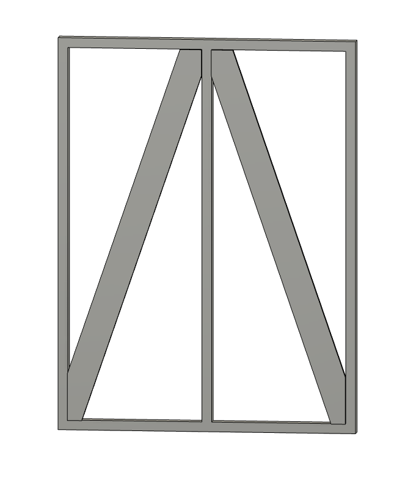
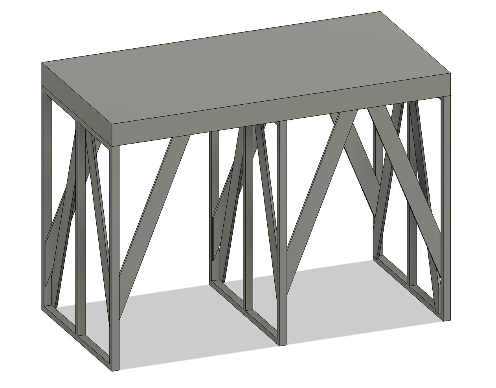

03-240236
前田陽祐

6/24 レポート課題

# 取り組む設計課題
演劇の大道具で用いる「人形脚」と呼ばれる部品の設計を行う。
人形脚とは図1のような形状をした部品で、
図2のように平台と組み合わせて高台を構成する。

{width=40%}

{width=50%}

このようにして構成される高台は、演劇の舞台上で役者が立つための台座として用いられる。
そのため、人形脚には一定の強度が求められる。
一方、素材のコストや加工の工数を考慮すると、人形脚の設計には最適化が求められる。
そこで、本課題では以下の条件で人形脚の最適設計を行う。

## （１）設計の善し悪しを判断するための指針
### 質量
材料費や工数を考慮すると、質量が軽いほど良い。

## （２）形状を表現する変数とその許容範囲
### 厚み40mmの平板内に収まること
人形脚は図1のように平坦な形状をしている。
そのため、最適設計においても厚み40mmの平板内に収まることを条件とする。
これは通常人形脚を作るために30x40mmの角材を使うことによる。

また、隣の高台との接合や側面の装飾のために、平板の左右の端に部材が存在する必要がある。

### 100kgの重量を支えることができること
高台が役者や平台の重量を支えるため、人形脚には一定の強度が求められる。
平台がおよそ20kg、大柄な役者であれば80kg程度と考え、
3倍の安全率を考慮すると100kgの重量を支えることができることが望ましい。
(人形脚は3つを組み合わせて高台を構成するため、3倍の安全率で1つあたり100kgになる）

より具体的には、100kgの荷重を受けたときに、主応力の最大値が基準値を超えないことが求められる。

## （３）⼒学的振る舞いを評価するための数理モデル
### 弾性⽅程式
Fusion360のシェイプ最適化を用いて最適設計を行う。

### 材料特性
材料は通常木材を用いるが、本課題では簡略化および最適化シミュレーションのために鋼を用いるものとして解析を行う。
軽量化を目的とした最適設計では棒状の部分が多くなることが予想されるため、木材の繊維方向を用いるものと考えて等方性を仮定することができる。

#### 応力の基準値
木材の圧縮方向の許容応力度は長期使用の場合$1.1Fc/3$によって求めることができる[^1]。
ここで、Fcは木材の圧縮方向の材料強度であり、甲種1級のアカマツの場合、$Fc=27.0\mathrm{MPa}$となる。[^2]。
したがって、許容応力度は$1.1\times27.0/3=9.9\mathrm{MPa}$となる。
これを基準値として、人形脚の設計を行う。

[^1]: 建築基準法施行令（昭和二十五年政令第三百三十八号）第八十九条第一項
[^2]: 木材の基準強度Fc、Ft、Fb及びFsを定める件（国土交通省告示第九一〇号）

# シミュレーションの詳細
## 固定条件
図3のように、厚み40mmの平板を縦に配置する。
底面を固定し、上面に1000Nの荷重を加える。

{width=40%}

