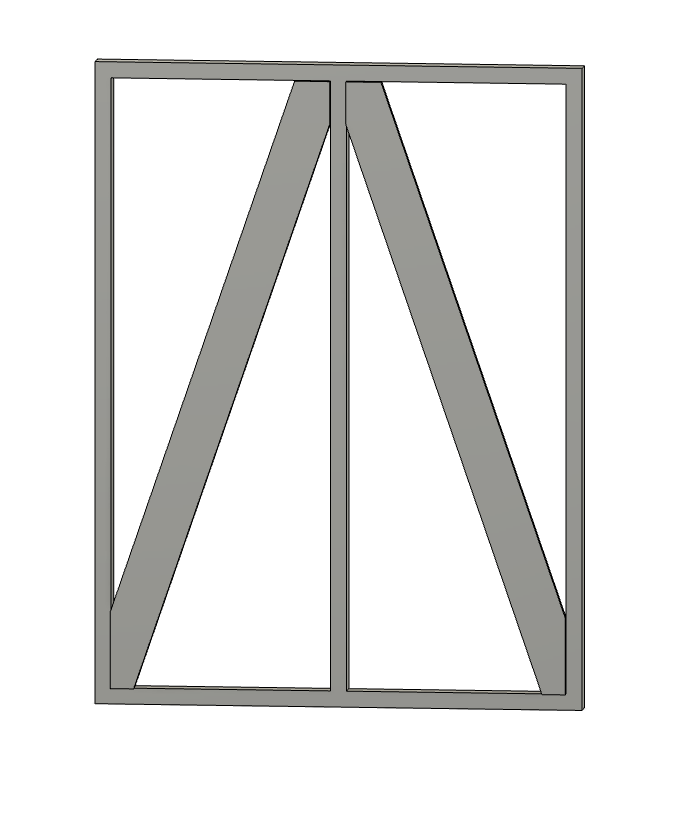
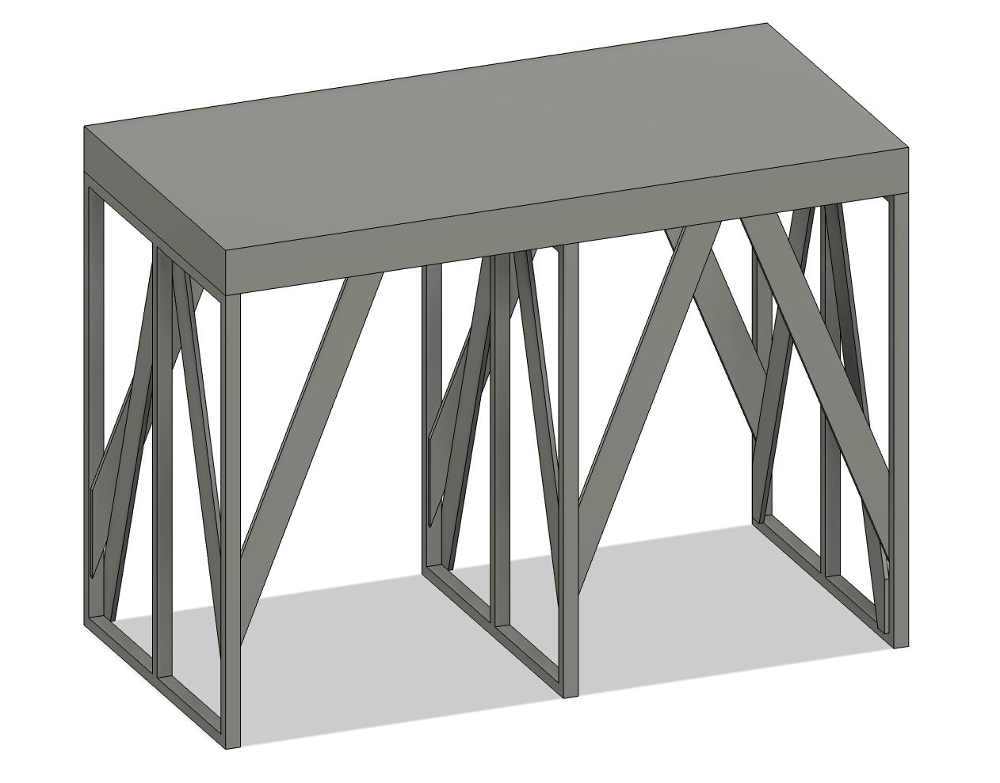

03-240236
前田陽祐

# 6/24 レポート課題

## 取り組む設計課題
演劇の大道具で用いる「人形脚」と呼ばれる部品の設計を行う。
人形脚とは図1のような形状をした部品で、
図2のように平台と組み合わせて高台を構成する

このようにして構成される高台は、演劇の舞台上で役者が立つための台座として用いられる。
そのため、人形脚には一定の強度が求められる。
一方、素材のコストや加工の工数を考慮すると、人形脚の設計には最適化が求められる。

そこで、本課題では以下の条件で人形脚の最適設計を行う。

## （１）設計の善し悪しを判断するための指針
剛性、最⼤ミーゼス応⼒、質量、慣性モーメント、変形量、圧⼒、温度、
流速、流束、流量、圧⼒損失、エネルギー変換効率、発電量、抵抗、

## （２）形状を表現する変数とその許容範囲
孔の位置、数、⼤きさ、⻑さ、⾼さ、など

## （３）⼒学的振る舞いを評価するための数理モデル
梁理論、熱伝導⽅程式、運動⽅程式、ナビエ・ストークス⽅
程式、弾性⽅程
