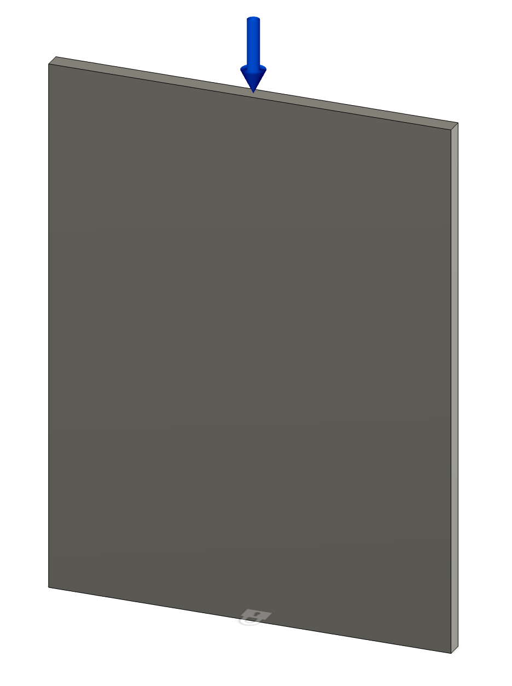
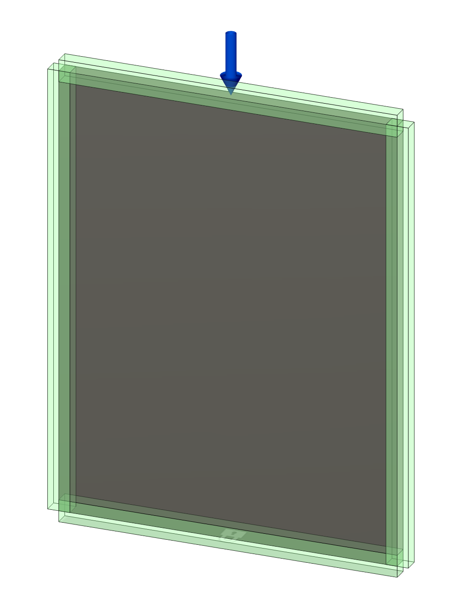

03-240236
前田陽祐

6/24 レポート課題

# 取り組む設計課題
演劇の舞台装置で用いる「人形脚」と呼ばれる部品の設計を検討する。
人形脚とは図1のような形状をした部品で、
図2のように平台と組み合わせて高台を構成する。

{width=30%}

{width=50%}

このようにして構成される高台は、演劇の舞台上で役者が立つための台座として用いられる。
そのため、人形脚には一定の強度が求められる。
一方、素材のコストや加工の工数を考慮すると、人形脚の設計には最適化が求められる。
そこで、本課題では以下の条件で人形脚の最適設計を行う。

## （１）設計の善し悪しを判断するための指針
### 質量
材料費や工数を考慮すると、質量が軽いほど良い。

### 剛性
役者が立つための台座として用いられるため、剛性が高いほど良い。

## （２）形状を表現する変数とその許容範囲
### 厚み40mmの平板内に収まること
人形脚は図1のように平坦な形状をしている。
そのため、最適設計においても厚み40mmの平板内に収まることを条件とする。
これは通常人形脚を作るために30x40mmの角材を使うことによる。

また、隣の高台との接合や側面の装飾のために、平板の左右の端に部材が存在する必要がある。

## （３）⼒学的振る舞いを評価するための数理モデル
### 弾性⽅程式
Fusion360のシェイプ最適化を用いて最適設計を行う。

### 材料特性
材料は通常木材を用いるが、本課題では簡略化および最適化シミュレーションのために鋼を用いるものとして解析を行う。
軽量化を目的とした最適設計では棒状の部分が多くなることが予想されるため、棒状の木材を使用することで最適設計を参考にした構造設計が可能だと考える。

\newpage

# シェイプ最適化
## 固定条件
図3のように、厚み40mmの平板を縦に配置する。
底面を固定し、上面に1000Nの荷重を加える。

{width=25%}

また、3辺の材を残すために、図4のように領域を保持する。
保持する領域は、厚み40mmの平板の左右上下の端から30mmの範囲である。

{width=25%}

## 目標
本課題の目的として、剛性を維持したまま質量を軽量化することが挙げられる。
しかし、Fusion360のシェイプ最適化では軽量化の目標を設定することができないため、
剛性を最大化する最適化を質量制限を変えながら行うことで代用する。

したがって、最適化の目標は「最大剛性」および「質量制限」である。
本課題では質量制限として、A: 50%, B: 30%の2つの条件で最適化を行う。

## 結果
### A: 50%の質量制限
最適化の結果、図5のような形状が得られた。

{width=80%}

図5をみると、中央に太い柱が形成されていることがわかる。
中央に柱を作ることで梁の長さを短くし、剛性を高めるねらいがあると解釈できる。

### B: 30%の質量制限
最適化の結果、図6のような形状が得られた。

{width=80%}

図6をみると、図5とは異なり、左右の材を残して上辺から左右の材に向かって斜めの材が形成されていることがわかる。
厳しい質量制限によって中央の柱を作ることができなくなったため、アーチ状の構造を形成して荷重を支えるようになったと考えられる。

## 考察
図1と図5、図6を比較すると、従来の人形脚の設計に合理性があることがわかる。
図1の人形脚は接合に必要な左右の縦材の他に中央にも縦材を持っており、結果Aの最適化に近い形状となっている。
また、図1で斜めにつけられている材は本来は直角を担保するための補助材であるが、結果Bのように中央の荷重を逃す機能も持っていることがわかる。

{width=50%}
