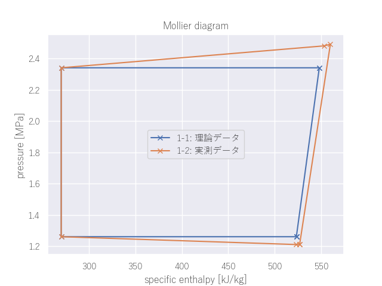
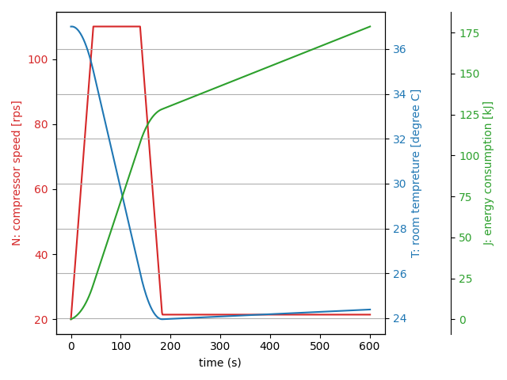
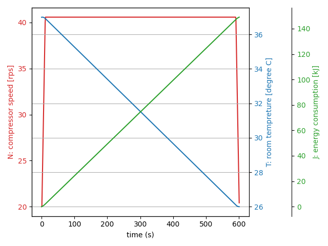
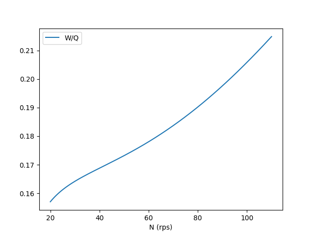

03-240236

前田陽祐

冷凍サイクルのデータ解析　机上課題

# 1
## 1-1: 理論データ
暖房能力: 3.891 [kW]

圧縮機動力: 0.346 [kW]

暖房COP: 11.251

## 1-2: 実測データ
暖房能力: 3.394 [kW]

圧縮機動力: 0.397 [kW]

暖房COP: 8.544

## 考察
{ width=70% }

暖房能力を比べると、理論値の方が実測値よりも大きかった。
ムーリエ線図を見ると、サイクルのグラフは理論値よりも実測値の方が大きいが、それは圧縮機でより大きな動力を用いているためだと考えられる。

# 2
## Problem A

{ width=50% }

26度に到達するまでの時間: 139 s

10分経過時の累積消費電力: 178.7 kJ

## Problem B

{ width=50% }

26度に到達するまでの時間: 599 s

10分経過時の累積消費電力: 149.0 kJ

## 考察
W/Qのグラフ（図4）を見ると、圧縮機の回転数Nが大きいほどW/Qの比は大きくなる、
つまり室内に単位熱量を伝えるのに必要な電力が大きく、暖房効率が悪いいことがわかる。

{ width=70% }

A（室温が26度に達する時刻が最も早いことを目指す）では、回転数が最大の状態で26度に到達するまで運転し、
そのあとは外部との熱のやりとりを相殺する程度の回転数で維持した（図2）。
この場合、回転数が大きく暖房効率の低い領域を使用しているため、10分経過時の累積消費電力は大きくなる。

B（なるべく消費電力が低いことを目指す）では、10分以内に室温を26度に到達させるという条件の元でなるべく低い回転数を用いるようにした。
図3においてx分からy分までの回転数は約40.6rpsであり、Aよりも低い回転数で運転していることがわかる。
このため、10分経過時の累積消費電力はAよりも小さくなる。

\newpage

# コード
## 1
```python
import matplotlib.pyplot as plt
import seaborn as sns
import pandas as pd

# 理論データ
data1 = pd.DataFrame({
    "name": ["compressor in", "compressor out", "out heat ex (gas)", "out heat ex (liquid)", "in heat ex (liquid)", "in heat ex (gas)"],
    "temperature": [19, 59.4, 19, 14.4, 37.4, 59.4],  # [°C]
    "pressure": [1.26, 2.34, 1.26, 1.26, 2.34, 2.34],  # [MPa]
    "specific enthalpy": [523.4, 548.1, 523.4, 270.2, 270.2, 548.1],  # [kJ/kg]
    "specific entropy": [2.12, 2.13, 2.12, 1.24, 1.24, 2.13],  # [kJ/(kgK)]
    "density": [33.4, 56.5, 33.4, -1, 905.9, 56.5],  # [kg/m3]
    "flow": [1.4e-2] * 6  # [kg/s]
})


# 実測データ
data2 = pd.DataFrame({
    "name": ["compressor in", "compressor out", "out heat ex (gas)", "out heat ex (liquid)", "in heat ex (liquid)", "in heat ex (gas)"],
    "temperature": [20.5, 70.5, 17.8, 14.4, 37.4, 65.2],  # [°C]
    "pressure": [1.21, 2.49, 1.21, 1.26, 2.34, 2.48],  # [MPa]
    "specific enthalpy": [526.9, 560.0, 523.2, 270.2, 270.2, 553.0],  # [kJ/kg]
    "specific entropy": [2.14, 2.15, 2.13, 2.10, 1.23, 2.13],  # [kJ/(kgK)]
    "density": [31.3, 56.8, 32.1, -1, 906.0, 58.6],  # [kg/m3]
    "flow": [1.2e-2] * 6  # [kg/s]
})


def problem1(data, fig, ax, label):
    # モリエル線図
    plot_order = [0, 2, 3, 4, 5, 1, 0]
    enthalpy = [data["specific enthalpy"][i] for i in plot_order]
    pressure = [data["pressure"][i] for i in plot_order]
    ax.plot(enthalpy, pressure, label=label, marker='x')

    # 暖房能力
    q = (data["specific enthalpy"][5] - data["specific enthalpy"][4]) * data["flow"][0]
    print(f"暖房能力: {q:.3f} [kW]")

    # 圧縮機動力
    w = (data["specific enthalpy"][1] - data["specific enthalpy"][0]) * data["flow"][0]
    print(f"圧縮機動力: {w:.3f} [kW]")

    # 暖房COP
    cop = q / w
    print(f"暖房COP: {cop:.3f}")


if __name__ == "__main__":
    sns.set(font='Yu Gothic')
    fig, ax = plt.subplots()
    ax.set_xlabel("specific enthalpy [kJ/kg]")
    ax.set_ylabel("pressure [MPa]")
    ax.set_title("Mollier diagram")
    print("1-1: 理論データ")
    problem1(data1, fig, ax, "1-1: 理論データ")
    print("1-2: 実測データ")
    problem1(data2, fig, ax, "1-2: 実測データ")
    ax.legend()
    plt.show()
```

## 2
```python
import numpy as np
import matplotlib.pyplot as plt

# ---- Constants ----

room_volume = 2.4 * 3.6 * 3.6  # m^3
rho_air = 1.166  # kg/m^3
C_air = 1006  # J/kgK
room_capacity = room_volume * rho_air * C_air  # J/K

T_init = 37  # deg C
T_targt = 26  # deg C
T_goal_range = 0.5  # deg C

Qin = 800  # W
Qout = 0  # W

N_init = 20  # rps
max_N_diff = 2  # rps/s
N_max = 110  # rps
N_min = 20  # rps

duration = 10 * 60  # s


# ---- Functions ----


def Q_cool(N):
    return 5.56e-4 * N**3 - 6.26e-2 * N**2 + 39.8 * N - 66.9  # W


def W_comp(N):
    return 3.25e-4 * N**3 - 2.31e-2 * N**2 + 7.24 * N - 26.9  # W


plt.plot(
    np.linspace(N_min, N_max, 1000),
    Q_cool(np.linspace(N_min, N_max, 1000)),
    label="Q_cool",
)
plt.plot(
    np.linspace(N_min, N_max, 1000),
    W_comp(np.linspace(N_min, N_max, 1000)),
    label="W_comp",
)
plt.xlabel("N (rps)")
plt.legend()
plt.show()

plt.plot(
    np.linspace(N_min, N_max, 1000),
    W_comp(np.linspace(N_min, N_max, 1000)) /
    Q_cool(np.linspace(N_min, N_max, 1000)),
    label="W/Q",
)
plt.xlabel("N (rps)")
plt.legend()
plt.show()

# 維持に必要な最低の回転数

N_maintain = N_max
for n in np.linspace(N_min, N_max, 100000):
    if Q_cool(n) > Qin:
        N_maintain = n
        print(f"N_maintain: {N_maintain}, Q_cool: {Q_cool(N_maintain)}")
        break


class Problem:
    def __init__(self):
        self.N = N_init
        self.N_target = N_max
        self.T = T_init

        self.time_record = -1
        self.N_record = [self.N]
        self.T_record = [self.T]
        self.J_sum = 0  # 消費電力の積算値
        self.J_record = [self.J_sum]

    def main(self):
        for t in range(duration + 1):
            self.update(t)
        self.plot()
        print("Result:")
        print(f"Time to reach goal: {self.time_record} s")
        print(f"Total energy consumption: {self.J_sum / 1000:.1f} kJ")

    def update(self, t):
        self.T += (Qin - Q_cool(self.N) - Qout) / room_capacity

        self.set_N_target()
        self.N += self.dN()

        self.record(t)

    def set_N_target(self):
        if self.T < T_targt:
            self.N_target = N_maintain
        if self.T < T_targt - T_goal_range / 2:
            self.N_target = N_maintain - 1

    def dN(self):
        if self.N < self.N_target - max_N_diff:
            return max_N_diff
        elif self.N > self.N_target + max_N_diff:
            return -max_N_diff
        return self.N_target - self.N

    def record(self, t):
        if self.T <= T_targt:
            if self.time_record < 0:
                self.time_record = t

        self.N_record.append(self.N)
        self.T_record.append(self.T)
        self.J_sum += W_comp(self.N)
        self.J_record.append(self.J_sum)

    def plot(self):
        fig, ax1 = plt.subplots()

        color = "tab:red"
        ax1.set_xlabel("time (s)")
        ax1.set_ylabel("N: compressor speed [rps]", color=color)
        ax1.plot(self.N_record, color=color)
        ax1.tick_params(axis="y", labelcolor=color)

        ax2 = ax1.twinx()
        color = "tab:blue"
        ax2.set_ylabel("T: room tempreture [degree C]", color=color)
        ax2.plot(self.T_record, color=color)
        ax2.tick_params(axis="y", labelcolor=color)
        plt.grid()

        J_kJ = [J / 1000 for J in self.J_record]
        ax3 = ax1.twinx()
        ax3.spines["right"].set_position(("outward", 60))
        color = "tab:green"
        ax3.set_ylabel("J: energy consumption [kJ]", color=color)
        ax3.plot(J_kJ, color=color)
        ax3.tick_params(axis="y", labelcolor=color)

        fig.tight_layout()
        plt.show()


# A: 最短の時間で室温を下げる

print("\nProblem A")
A = Problem()
A.main()

# B: 消費電力を最小化する


class ProblemB(Problem):
    def __init__(self):
        super().__init__()
        self.N_target = self.calc_N_target()
        print(f"N_target: {self.N_target}")

    def update(self, t):
        self.T += (Qin - Q_cool(self.N) - Qout) / room_capacity
        self.N = self.simlate_N(t, self.N_target)
        self.record(t)

    def calc_N_target(self):
        for n in np.linspace(N_min, N_max, 10000):
            if self.simulate_T_at_end(n) < T_targt:
                return n
        return N_max

    def simulate_T_at_end(self, N_target):
        T = T_init
        for t in range(duration + 1):
            T += (Qin - Q_cool(self.simlate_N(t, N_target)) - Qout) / room_capacity
        return T

    def simlate_N(self, t, target_N):
        if t < duration / 2:
            N = N_init + max_N_diff * t
        if t >= duration / 2:
            N = N_maintain - max_N_diff * (t - duration + 1)
        if N > target_N:
            N = target_N
        return N


print("\nProblem B")
B = ProblemB()
B.main()
```
